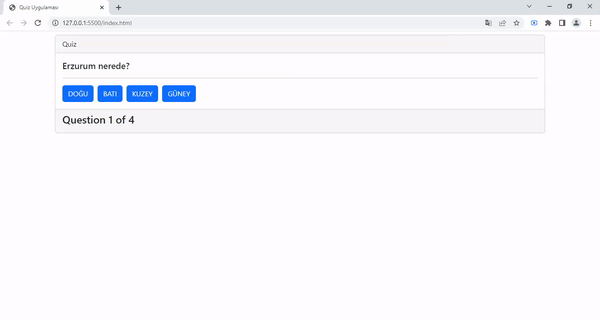

<h1> OOP Quiz Uygulaması</h1>

<h3>Kullanılan Teknolojiler</h3>

<h4>Javascript -HTML5- Bootstrap</h4>

Veri tabanında belirlenen şehirlerin haritadaki yönlerini tarayı üzerinden seçenekler ile bulmayı ve sonucu ekrana yazma amacıyla tasarlanmıştır

